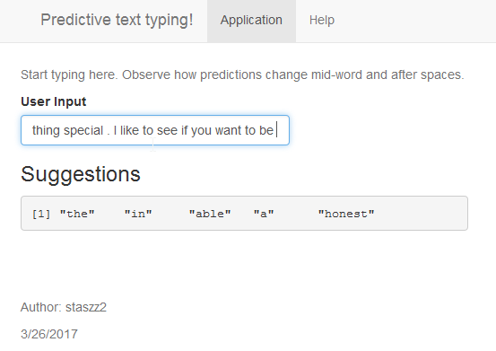

Predictive text typing
========================================================
author: staszz2
date: 3/26/2017
autosize: true

This application is a main deliverable for Data Science 
course capstone project at coursera.com


What this is.
========================================================

<font size="5">

This technology allows a typist (either person or a machine) to
select next word in the sentense from pre-typed choices thus saving time 
on input and increasing spelling accuracy

Obvious benefits
- Increased velocity of typing on many types of on-screen devices (cell, tablet)
- Improved accessibility for impaired typists (medical aid)
- Aid any type of computer writing with concurrent functions of thesaurus, spell-check, pre-entry (modern type writing software)

Potential benefits
- Aid machines in crafting human-like responses (status, event, alert reports)
- Provide suggestions for search terms in general or retail inquiries (search boxes, ads)
- ??? (anywhere simple language is used)

</font>

General Methodology
========================================================

<font size="5">

3 Million human messages containing 70 million words were processed from Twitter, News and Blogs repositories to identify **most common** 8364 words and 20,000 2,3,4-word phrases. Alternatively, a common dictionary can be used for single words and and all-inclusive phrases sacrificing the performance.

As user types, the application considers the current input and automatically provides the next most likely word selection in line. This is done by breaking the current word or incomplete sentence into fragments of 2,3,4 words and matching them to aforementioned phrase repository. 

Example1: user types "Can't wait ". Application predicts:


```
[1] "till"  "to"    "for"   "til"   "until"
```

Example2: user types "I have been in the ". Application predicts:


```
[1] "world"   "first"   "past"    "morning" "middle" 
```

Example dictionary: Most common 3-word combinations:

```
                   phrase count
22       couple weeks ago    26
9      gov chris christie    38
14        st louis county    38
10 president barack obama    74
11          two years ago   113
20         new york times   147
12          new york city   475
2          happy new year   548
3             let us know  1215
1       happy mothers day  2934
```

</font>

Proof of concept (POC) user interface
========================================================

<font size="5">

The very same technology and derived word dictionaries are used in the following web application.

https://staszz2.shinyapps.io/Data_Science_Capstone/

1. Start typing words
2. See the suggested next words
3. Select words to form fun stories

</font>

</img>


Resources
========================================================

- 
<font size="5">

**Note**: I processed for n-grams that have multiple appearances. Therefore only common phrases are present in n-gram files. See BuildDatagrams.R in repo

*Application* - https://staszz2.shinyapps.io/Data_Science_Capstone/

*Source code* - https://github.com/staszz2/Capstone

*Basics of natural language processing* - https://en.wikipedia.org/wiki/Natural_language_processing

*Inspired by swift key* - https://swiftkey.com/en

*Coursera Data Science course* - https://www.coursera.org/specializations/jhu-data-science

</font>

- 


